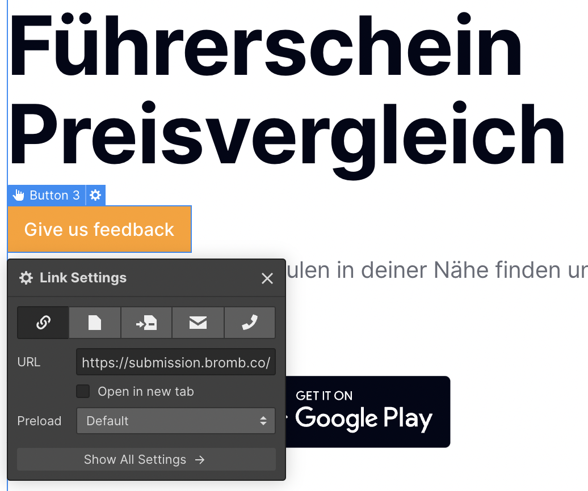

# Getting started 

## 1. Copy the following code

Copy the following `<script>` `</script>` and place it in the head of your HTML. 

```html
<script
	async
	defer
	data-theme="light"
	src="https://cdn.jsdelivr.net/gh/samuelstroschein/bromb/packages/web/dist/widget.js"
></script>
```

<aside>
👇 After pasting the script into the head of your website, the code should look similar to this:

</aside>

```html

<head>
	... other code
	<script
		async
		defer
		data-theme="light"
		src="https://cdn.jsdelivr.net/gh/samuelstroschein/bromb/packages/web/dist/widget.js"
	></script>

</head>
```

## 2. Trigger the widget

The bromb widget is triggered by clicking on a link on your site which follows the following schema `https://submission.bromb.co/<your organization name>/<your project name>`. We'll call that link **the trigger link**. In the case of ourselves, we simply place [https://submission.bromb.co/bromb/dashboard](https://submission.bromb.co/bromb/dashboard) somewhere in our website to trigger the widget.

### Website Builder

you can trigger the widget by placing a trigger link on your page. 



### Code

place an `<a>` in your markup. 

```html
<a href="https://submission.bromb.co/<your organization>/<your project>">
  Give us feedback
</a>
```

